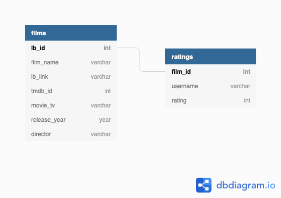
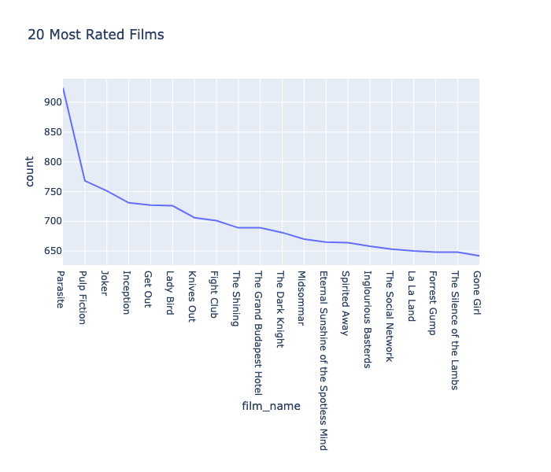
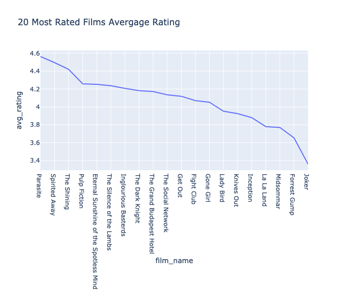
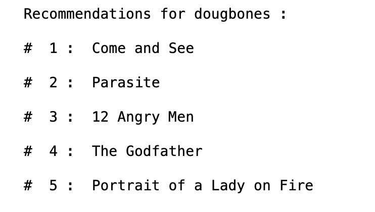
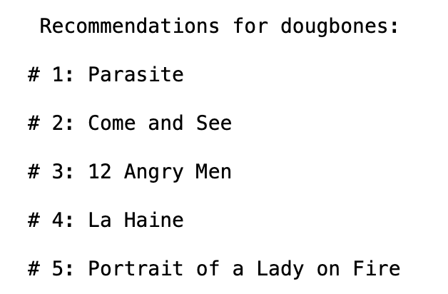
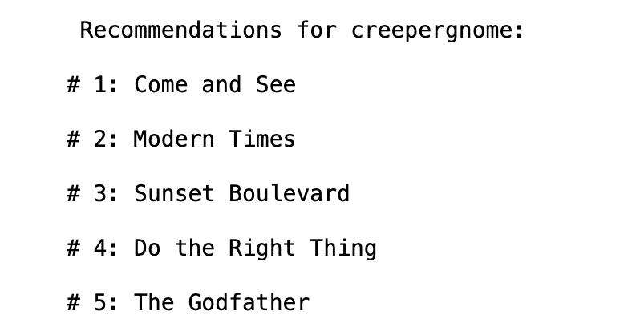
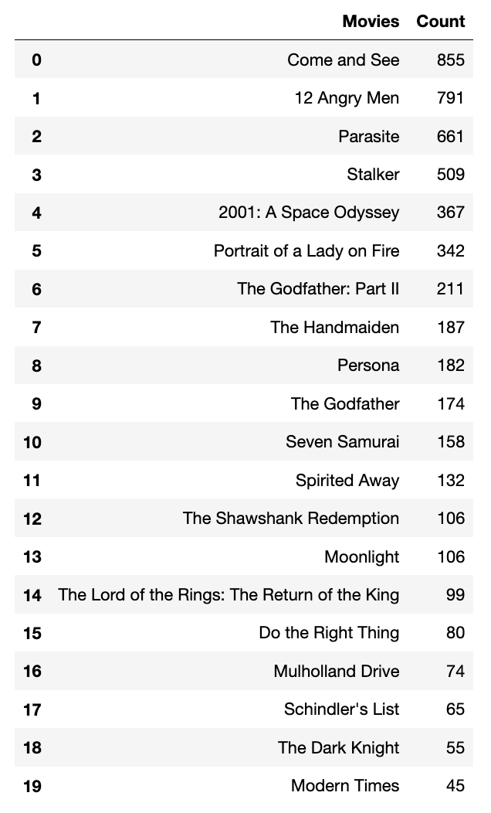
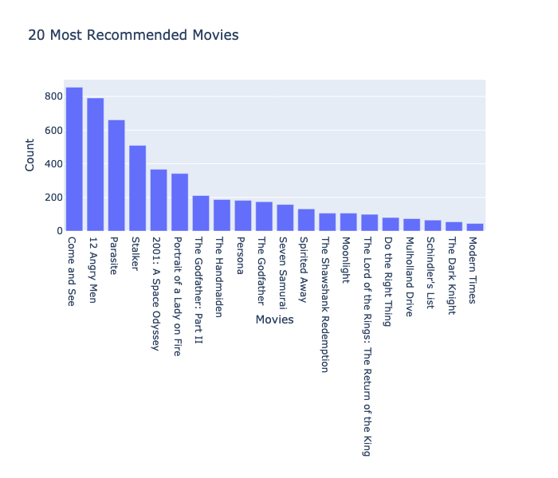

# Letterboxd Recommendation System

## Business Case:
Through this project, we aim to create a recommendation systems that will recommend 5 movies to any given Letterboxd user. There will be various methods including non-personal recommendations and collaborative recommendations using Surprise and PySpark. 

## Methodology:
There are three main notebooks used for this project. The first two are used to gather data from Letterboxd and TMdB through web-scraping and an API. The other notebook is where the actual recommendation system code is located. 

### Web-Scraping Notebook Methodology
[github repo](https://github.com/cristinamtown/flatiron_capstone/blob/main/Data.ipynb)
1. Import necessary libraries including Beautiful Soup, Pandas, and Requests.
2. Create a function that scrapes the usernames that follows the given username and returns the usernames in a list.
3. Run user_list function with 'fuchsiadyke' to scrape the usernames since they are followed by over 16,000 users ensuring we can easily gather over 2,000 usernames from them.
4. Create and run a function that uses the list of usernames to scrape user ratings from Letterboxd and store it in a dataframe.
5. Save the dataframe as a .csv file.
6. Create and run a function that scrapes information for the first 3000 pages of the most popular films on letterboxd. 
7. Create and run a function that scrapes director name, tmdb id, and whether it is a movie or tv show.
8. Remove the year from the movie name and create a new column with it.
9. Save the dataframe as a .csv file.
10. Create a function to create data frames for individual users.
11. Create and save a SQL database with the two main tables.

### tmdb API
[github repo](https://github.com/cristinamtown/flatiron_capstone/blob/main/TMDB%20.ipynb)
This notebook will be used to add genres, film length, and other information to the film information table using the tmdb api.
It is still a work in progress. 

### Recommendation System
[github repo](https://github.com/cristinamtown/flatiron_capstone/blob/main/Recommendation%20System.ipynb)
1. Import necessary libraries for pandas, SQL, and plotly.
2. Initialize connection to SQL database.
3. A quick look at the data and EDA.
4. A non-personalized recommendation system: top 20 rated films.
5. Create and run a function that makes a dataframe with the target user's rating information.
6. Create a rating dataframe from the SQL database and ensure it is in a form that can be used with the models.
7. Remove any films that have fewer than the given threshold. This helps prevent the models from breaking.
8. Import SVD libraries and prepare data to run in the SVD model.
9. Train/Test split the rating data.
10. Run, test model, and evaluate the model.
11. Create a dataframe of the film information table of the SQL database. 
12. Run the model on the target user and print the top 5 recommendations. 
13. The KNN model is still a work in progress.
14. Import necessary libraries for the PySpark ALS model.
15. Prepare data that will be used in the model.
16. Train/Test split the rating data.
17. Run, test model, and evaluate the model.
18. Create a dataframe of the film information table of the SQL database.
19. Run the model on the target user and print the top 5 recommendations. 
20. Do a quick post-model examination of the predictions and check for bias.

## The Data

The SQL table belows shows the makeup of the two tables used in this project. 

As of now, the table has 579,707 ratings from 1,199 users rating 77,772 different movies.

## Results
### Non Personalized Recommendation System

Here we can see that the 5 movies that have been rated most are *Parasite*, *Pulp Fiction*, *Joker*, *Inception*, and *Get Out*. This tells us which movies are being watched most by our users. 

Here we can see that when you take into account the average ratings of the 20 most rated films, we can see that the top 5 recommended movies are *Parasite*, *Spirited Away*, *The Shining*, *Pulp Fiction*, *Eternal Sunshine of the Spotless Mind* 

### SVD Model
rsme: 0.7041

This model was tested on two letterboxd users.

user dougbones: 201 films logged and 22 ratings

user creepergnome: 2,901 films logged and 2,234 ratings

### PySpark ALS Model
rsme: 0.7057

This model was tested on the same two users.

user dougbones:

user creepergnome:

**PySpark ALS Post Model EDA**

Post madel examination was done on the Pyspark model. Here we looked at the 20 most recommended films across all users.

This shows the *Come and See*, *Parasite*, and *12 Angry Men* were recommended to over half of our user base. This might lead to recommendation bias and will need to be watched. 

## Conclusions
 - For new users or user that choose not to log or rate movies, the Non-Personal Recommendation system can be used
 
 - For users that have some movies rated, either the SVD or ALS model can be used. I would lean more to the SVD model due to being more time efficient. 

## Future Work
- Expand the number of users used in the models

- Use tmdb api to add genre, film length, and other information to film_info table

- Create recommendations on additional information in film_info table

- Create a front end so anyone can input a letterboxd username and receive movie recommendations

